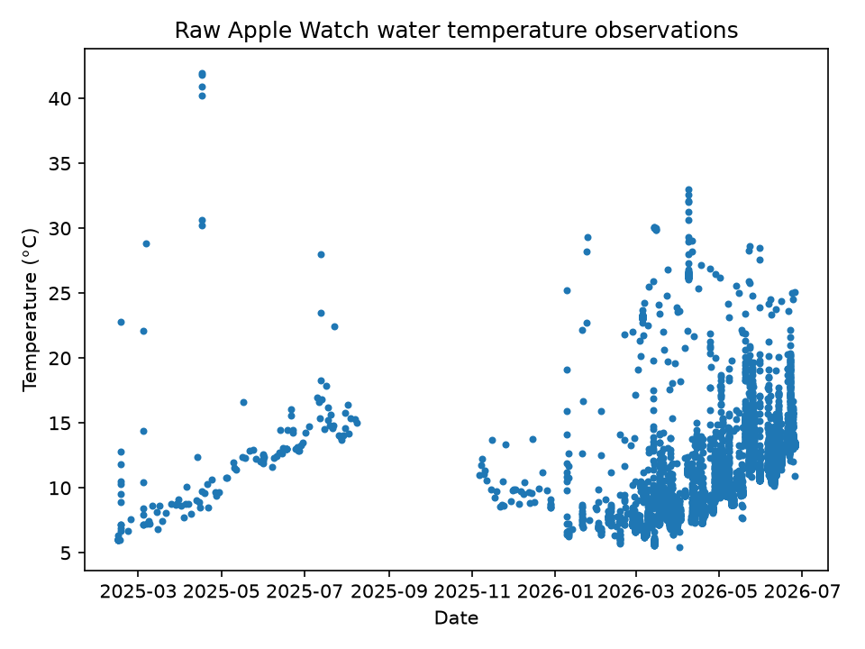
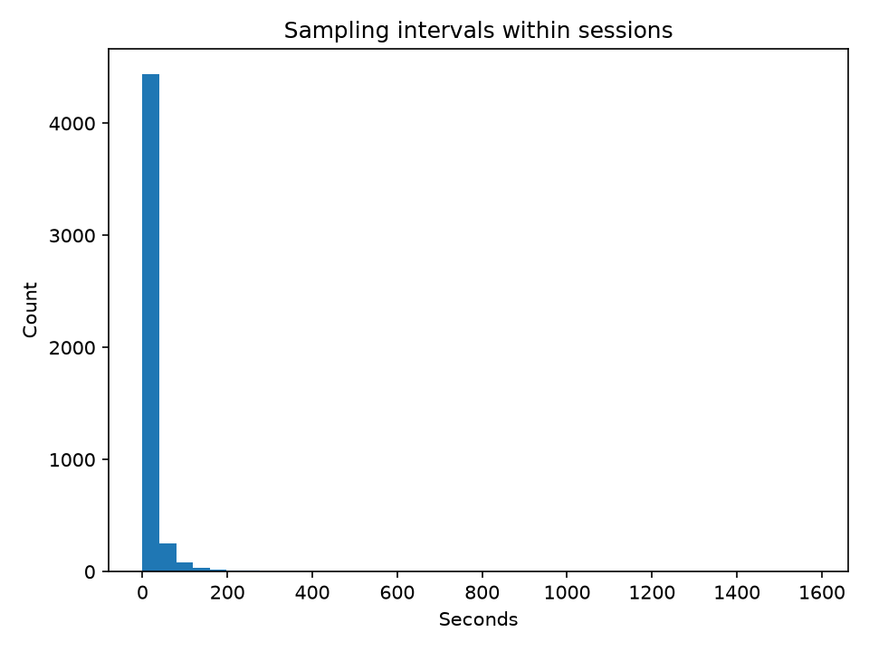
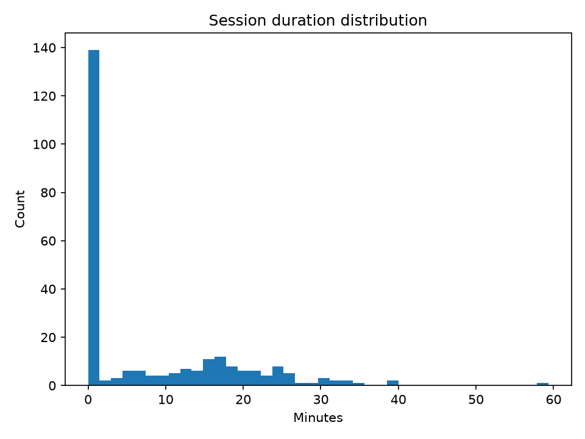
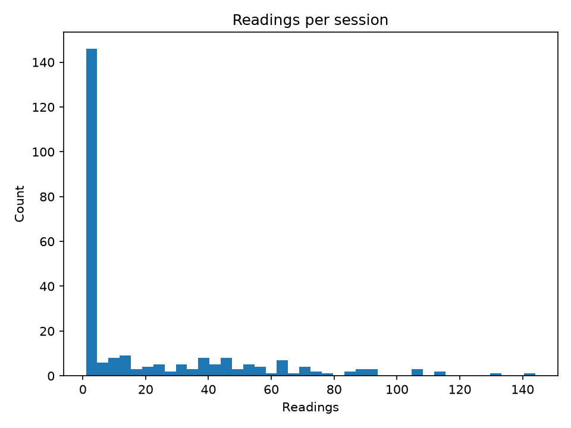

# Whitley Bay Multi-Source Sea Temperature Record

## Apple Watch Sensor Characterisation Report v0.1

### Bringing together swimmers, satellites and history to understand Whitley Bay's changing sea temperature.

---

## 1. Purpose

This report characterises Apple Watch water temperature observations extracted from Apple Health.

The aim is to understand the behaviour of the Apple Watch as a water temperature sensor before deriving representative sea temperature estimates.

---

## 2. Dataset overview

| Metric | Value |
|---|---:|
| Raw water temperature observations | 5,129 |
| Observation period | 2025-02-14 to 2026-06-25 |
| Sessions using 30-minute gap rule | 255 |
| Single-observation sessions | 134 |
| Short sessions, 2–4 readings | 12 |
| Continuous sessions, 5+ readings | 109 |

---

## 3. Temperature range and high values

Apple Health records a wide range of water temperature values. Some high values are unlikely to represent open seawater at Whitley Bay and are probably affected by body heat, wetsuit coverage, post-swim warming, showering or other non-sea exposure.

| Metric | Value |
|---|---:|
| Minimum recorded temperature | 5.46°C |
| Maximum recorded temperature | 41.97°C |
| Readings >=20°C | 337 |
| Readings >=25°C | 142 |

---

## 4. Sampling behaviour

Where the watch records multiple readings within a session, the sampling interval is typically short.

| Metric | Value |
|---|---:|
| Median sampling interval | 17.0 seconds |
| Number of within-session intervals | 4,874 |

Sampling interval percentiles:

- 10th percentile: **11.0**
- 25th percentile: **15.0**
- 50th percentile: **17.0**
- 75th percentile: **19.0**
- 90th percentile: **36.0**
- 95th percentile: **64.3**

---

## 5. Session duration

Session duration is calculated as the time between the first and last water temperature observation in each session.

Duration percentiles:

- 10th percentile: **0.0**
- 25th percentile: **0.0**
- 50th percentile: **0.0**
- 75th percentile: **16.0**
- 90th percentile: **23.8**
- 95th percentile: **26.5**

---

## 6. Readings per session

A substantial number of sessions contain only one or a small number of readings. These should be treated differently from continuous sessions where a stable temperature plateau can be identified.

Readings-per-session percentiles:

- 10th percentile: **1.0**
- 25th percentile: **1.0**
- 50th percentile: **1.0**
- 75th percentile: **36.5**
- 90th percentile: **65.0**
- 95th percentile: **86.2**

---

## 7. Initial interpretation

The Apple Watch appears to provide useful in-water temperature observations, but the data should not be treated as a complete diary of all swims.

Several factors affect interpretation:

- More than one Apple Watch may have contributed data over the observation period.
- Recording behaviour may differ between devices or watchOS versions.
- Gaps in the record may reflect sensor availability rather than absence of swimming.
- High values suggest the sensor sometimes records body heat or post-swim warming.
- Single-observation sessions should not be treated as equivalent to continuous swim recordings.

---

## 8. Methodological implication

The preferred approach is to derive representative seawater temperature from the stable temperature plateau within continuous swim sessions.

Sessions without enough observations to identify a stable plateau should be flagged with lower confidence or held for manual review.

---

## 9. Next steps

Recommended next steps:

1. Implement stable plateau detection for continuous sessions.
2. Assign confidence categories based on readings, duration and plateau quality.
3. Compare representative Apple Watch temperatures with Copernicus SST.
4. Compare with historical local water temperature records where dates overlap.
5. Produce a validated `apple_watch_sessions.csv` dataset.

---

## Status

**Version:** 0.1  
**Generated from:** `water_temperatures.csv`

This report is an initial sensor characterisation and should not yet be treated as a final validation of Apple Watch-derived sea temperature.
